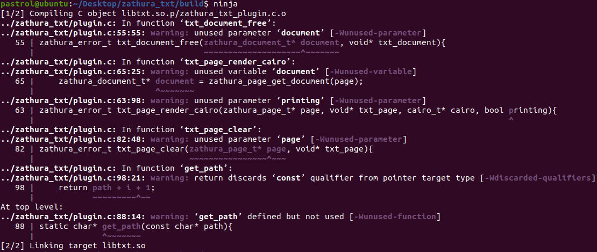
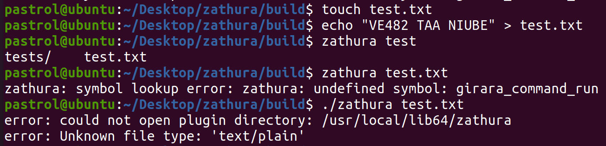
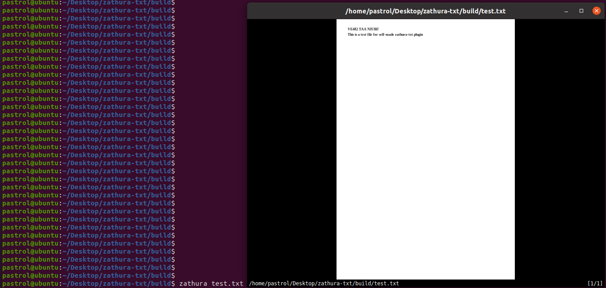

## A real life software	

Steps to build Zathura

```shell
# Install dependencies
sudo apt install libglib2.0-dev libgtk-3-dev libgirara-dev doxygen check libjson-c-dev gettext clang cmake
# Git clone
git clone https://git.pwmt.org/pwmt/zathura.git
cd zathura
git checkout master
# Install
cd zathura
mkdir build
meson build 
cd build
ninja 
ninja install
```

Then we create our own Zathura plugin for txt files based on its `plugin.h` file, which is shown as follows:

```c
#include <zathura/plugin-api.h>

ZATHURA_PLUGIN_REGISTER_WITH_FUNCTIONS(
  "txt",
  VERSION_MAJOR, VERSION_MINOR, VERSION_REV,
  ZATHURA_PLUGIN_FUNCTIONS({
    .document_open            = txt_document_open,
    .document_free            = txt_document_free,
    .page_init                = txt_page_init,
    .page_clear               = txt_page_clear,
    .page_render_cairo        = txt_page_render_cairo,
  }),
  ZATHURA_PLUGIN_MIMETYPES({
    "text/plain"
  })
)
  
/**
 * Open a txt document
 *
 * @param document Zathura document
 * @return ZATHURA_ERROR_OK if no error occurred otherwise see
 *   zathura_error_t
 */
GIRARA_HIDDEN zathura_error_t txt_document_open(zathura_document_t* document);

/**
 * Closes and frees the internal document structure
 *
 * @param document Zathura document
 * @return ZATHURA_ERROR_OK if no error occurred otherwise see
 *   zathura_error_t
 */
GIRARA_HIDDEN zathura_error_t txt_document_free(zathura_document_t* document, void* txt_document);

/**
 * Initializes the page with the needed values
 *
 * @param page The page object
 * @return ZATHURA_ERROR_OK when no error occurred, otherwise see
 *    zathura_error_t
 */
GIRARA_HIDDEN zathura_error_t txt_page_init(zathura_page_t* page);

/**
 * Frees a PostScript page
 *
 * @param page Page
 * @return ZATHURA_ERROR_OK if no error occurred otherwise see
 *   zathura_error_t
 */
GIRARA_HIDDEN zathura_error_t txt_page_clear(zathura_page_t* page, void* txt_page);

/**
 * Renders a page onto a cairo object
 *
 * @param page Page
 * @param cairo Cairo object
 * @param printing Set to true if page should be rendered for printing
 * @return ZATHURA_ERROR_OK if no error occurred otherwise see
 *   zathura_error_t
 */
GIRARA_HIDDEN zathura_error_t txt_page_render_cairo(zathura_page_t* page, void* txt_page, cairo_t* cairo, bool printing);
```

Then we rebuild Zathura to add the plugin. Check the directory `Zathura-txt` for source code.

```shell
meson build
cd build
ninja
ninja install
```

Compile Result:



Before the rebuild:



After the rebuild:



### TroubleShooting

1. In the process, I found that `sphinx` is used to generate doc for Zathura. However, the directory of doc is misplaced and Zathura could not be correctly installed consequently. So I remove the line `subproject(doc)` to avoid this issue.
2. We need to specify library related to girara to install Zathura correctly. I did this by running `export LD_LIBRARY_PATH=/usr/local/lib64`.
3. When I install a plugin for Zathura, the meson use `pkg-config` to search for all dependencies. It may occur to you that the path where you install `zathura.pc` is not in the searching list of `pkg-config`. In my case, I run `export PKG_CONFIG_PATH=/usr/local/lib64/pkgconfig/` to fix this issue.

